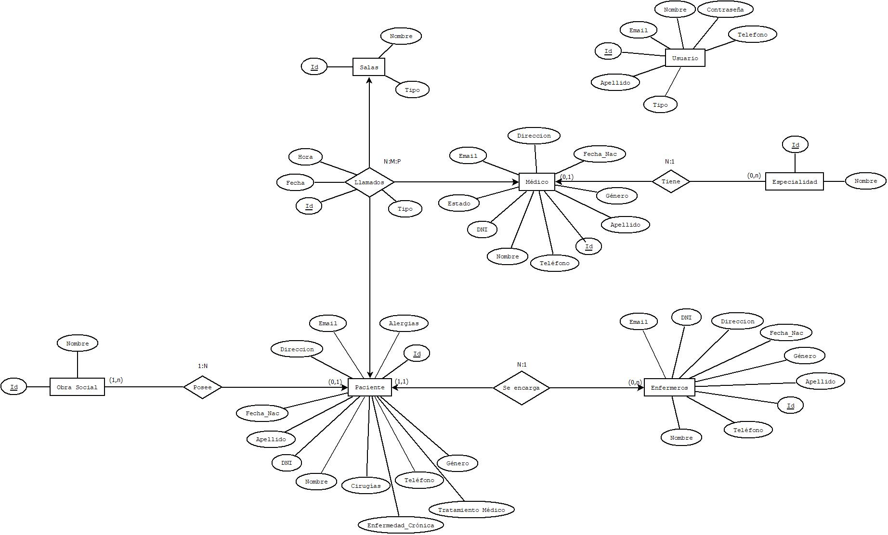
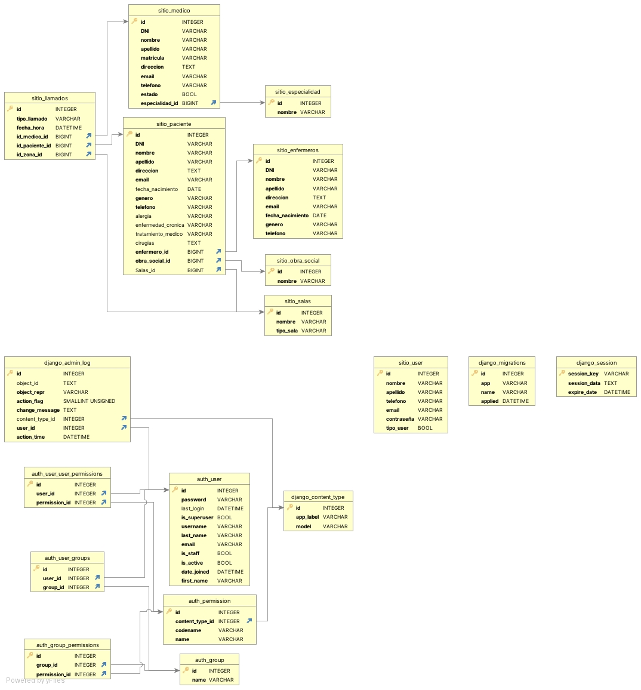
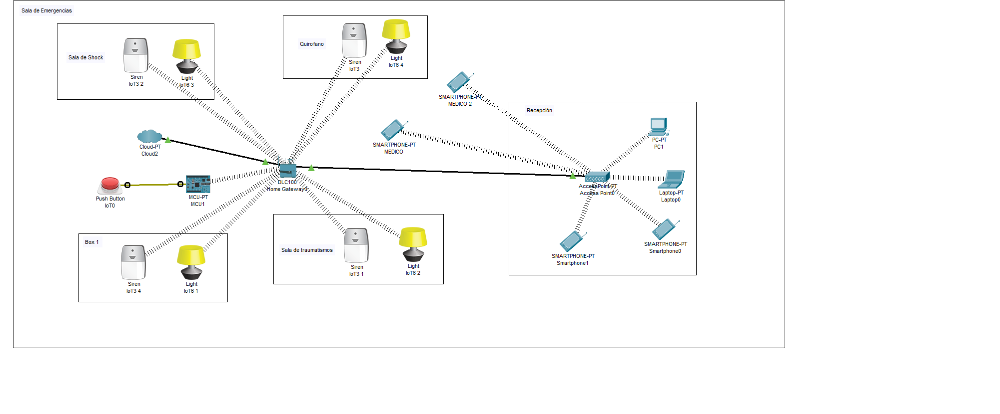

Olimpiadas INET: Sistema de Gestión de Emergencias Hospitalarias 🏥
🏆 Contexto Competitivo
Este proyecto fue desarrollado para las Olimpiadas Nacionales de Educación Técnica (INET). Representa una solución integral de software diseñada bajo presión competitiva para resolver una problemática real: la optimización de tiempos de respuesta en entornos hospitalarios.

📝 Descripción del Proyecto
Se desarrolló una plataforma Full-stack de gestión de emergencias que permite la administración centralizada de pacientes, personal médico y recursos físicos (salas). El sistema incluye un motor de Triage Automático para la priorización de la atención médica basada en la gravedad de los casos.

## 📐 Diseño y Arquitectura de la Solución
Antes de la etapa de desarrollo, se realizó un exhaustivo modelado de la problemática para asegurar la escalabilidad y consistencia de los datos.

### Modelo Entidad-Relación (DER)
Diseño conceptual de las interacciones entre Pacientes, Médicos, Especialidades y el sistema de alertas.

### Esquema Relacional de Base de Datos
Estructura técnica de tablas y relaciones, incluyendo la integración con el motor de autenticación de Django.

### Simulación de Infraestructura e IoT
Arquitectura de red diseñada para el entorno hospitalario, integrando dispositivos de alerta (Sirenas/Luces) y conectividad para el personal médico.

🚀 Funcionalidades Clave
Sistema de Triage y Alarmas: Implementación de una escala de criticidad por colores para llamadas de emergencia no atendidas, identificando instantáneamente paciente, sala y especialidad requerida.

Gestión de Roles (RBAC): Niveles de acceso diferenciados para administradores, médicos y personal de recepción.

Módulo ABM (CRUD) Completo: Gestión dinámica de registros de pacientes, recetas digitales, especialidades médicas y disponibilidad de salas.

Persistencia y Trazabilidad: Historial completo de intervenciones para auditoría y seguimiento médico post-emergencia.

Multiplataforma: Desarrollo de una versión de escritorio/web y una aplicación móvil complementaria para la recepción de alertas en tiempo real.

📊 Dashboard de Analítica y Business Intelligence (BI)
El sistema integra un panel de control estadístico desarrollado con Chart.js, permitiendo transformar los datos transaccionales en indicadores visuales clave para la toma de decisiones:

Visualización Dinámica: Implementación de gráficos de barras y torta para monitorear el flujo de pacientes por jornada.

Demanda de Especialidades: Identificación visual de las áreas médicas con mayor saturación, facilitando la optimización de recursos.

Monitoreo de Emergencias: Reportes detallados sobre la frecuencia de alertas según el nivel de Triage (escala de colores), permitiendo analizar picos de demanda críticos.

🛠️ Tech Stack
Backend: Python & Django (ORM para gestión de base de datos y lógica de negocio).

Frontend: HTML5, CSS3, JavaScript.

Visualización de Datos: Chart.js (Integración de gráficos interactivos con el backend).

Diseño: Arquitectura de alto contraste "Black & White" para optimización de UX en entornos de alta presión.

Base de Datos: SQL (Gestión de relaciones complejas entre Médicos, Pacientes y Salas).

⚙️ Arquitectura Técnica
Manejo de Datos: Uso intensivo de Django Migrations para la estructuración de relaciones complejas entre Médicos, Pacientes y Recetas.

Lógica de Priorización: Algoritmo de ordenamiento de listas en tiempo real basado en el nivel de urgencia de la llamada.

